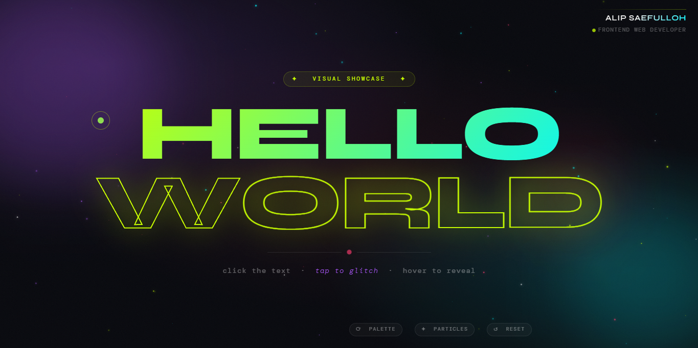

# 🌐 Hello World — Visual Showcase

A modern, colorful, and interactive single page website with **"Hello World"** as the main content.

🔗 **Live Demo** → [https://helloworldupgrade.netlify.app/](https://helloworldupgrade.netlify.app/)

---

## 🖼️ Preview



---

## 📁 File Structure

```
project/
└── index.html   ← single file, everything is included
```

---

## 🛠️ Tech Stack

| Technology | Version | Description |
|---|---|---|
| HTML | Semantic HTML5 | Page structure |
| Tailwind CSS | 3.4.1 (CDN) | Utility styling |
| JavaScript | Vanilla ES6 | Animations & interactions |
| Google Fonts | — | Syne + DM Mono |

---

## ✨ Features & Visual Effects

### Background
- **Animated mesh gradient** — three radial gradients in violet, cyan, and rose that drift slowly
- **Noise grain overlay** — subtle animated grain texture for a cinematic feel
- **Floating orbs** — three blurred colored circles floating at different speeds

### Hero Text "HELLO WORLD"
- **HELLO** — white-to-cyan gradient, changes to acid green on hover
- **WORLD** — hollow outline style, changes color on hover
- Each letter has a **shimmer bounce** animation with staggered delays
- **Glitch effect** with color distortion on click

### Particles
- 70 ambient particles floating across the screen
- **Particle burst** spawns from the click point when the text is clicked

### Custom Cursor (Desktop)
- Cursor replaced with an **acid green dot**
- **Circle trail** follows with a slight delay
- Cursor expands on mouse press

### Orb Parallax
- Large orb follows mouse movement smoothly

---

## 🎮 Interactions

| Action | Effect |
|---|---|
| Hover HELLO | Gradient shifts to acid green |
| Hover WORLD | Outline changes to acid green |
| Click the text | Glitch effect + particle burst |
| Move mouse | Large orb follows cursor position |
| `⟳ palette` button | Cycle through 4 color palettes |
| `✦ particles` button | Toggle particles on/off |
| `↺ reset` button | Restore default appearance |

---

## 🎨 Color Scheme

| Name | Hex | Role |
|---|---|---|
| Background | `#07080d` | Main dark background |
| Acid Green | `#c8ff00` | Main accent, cursor, badge |
| Cyan | `#00f5ff` | Text gradient, orb |
| Violet | `#a855f7` | Caption, orb |
| Rose | `#ff3c6f` | Divider dot, orb |
| White | `#f0f0f0` | Main text |

### Alternative Palettes (via Palette button)

| # | Acid | Cyan | Violet | Rose |
|---|---|---|---|---|
| 1 | `#c8ff00` | `#00f5ff` | `#a855f7` | `#ff3c6f` |
| 2 | `#ff9500` | `#ff3c6f` | `#ff6b6b` | `#ffd60a` |
| 3 | `#00ff88` | `#00cfff` | `#4f46e5` | `#f43f5e` |
| 4 | `#ff0099` | `#7c3aed` | `#06b6d4` | `#10b981` |

---

## 🔤 Typography

- **Syne** (700, 800) — hero text & author name
- **DM Mono** (300, 400, 500) — badge, caption, HUD pills, and role label

---

## 📐 Layout

```
┌─────────────────────────────────┐
│                    [Your Name]  │  ← top-right (author identity)
│           Frontend Web Developer│
│                                  │
│        ✦ visual showcase ✦      │
│                                  │
│           HELLO                  │
│           WORLD                  │
│                                  │
│           ——  •  ——              │
│    click the text · tap to glitch│
│                                  │
│  [⟳ palette] [✦ particles] [↺ reset]  ← bottom HUD
└─────────────────────────────────┘
```

---

## 📝 Notes

- This website is **not responsive** — designed for desktop viewing
- All assets (CSS, fonts) are loaded via CDN, internet connection required
- No additional dependencies beyond Tailwind CSS CDN

---

## 👤 Author

**Alip Saefulloh**  
Frontend Web Developer